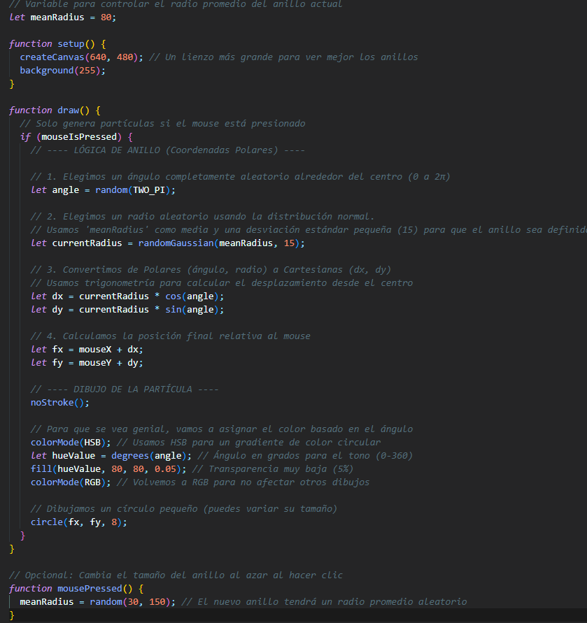
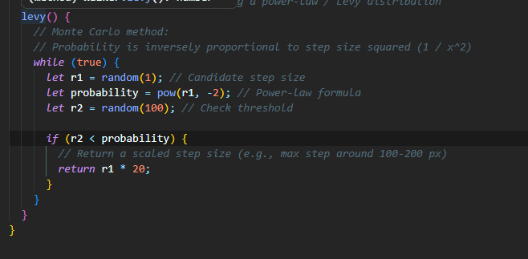
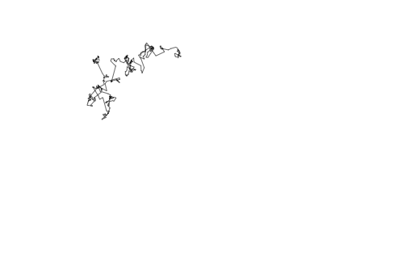
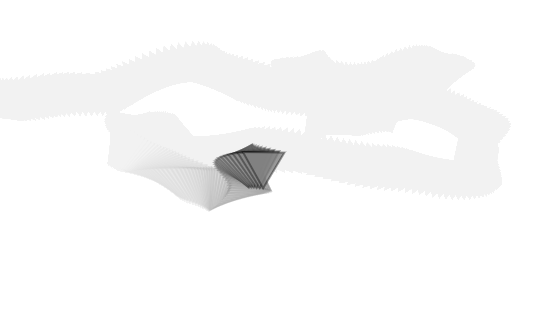
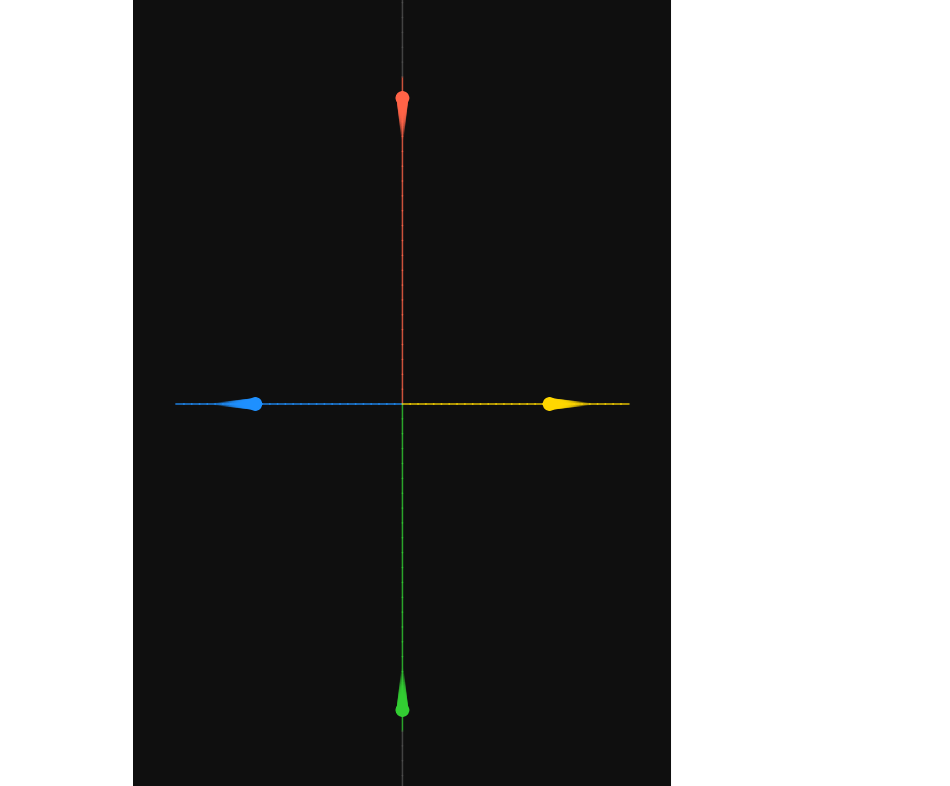
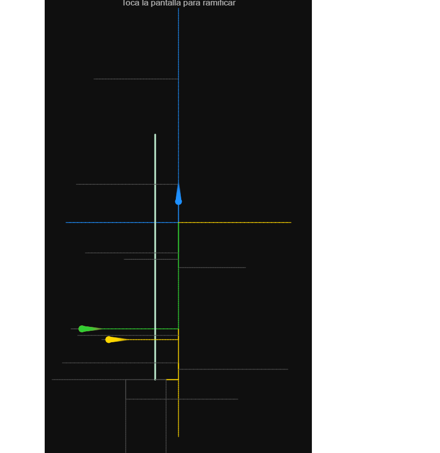

# Simulacion-2026

Bitácora Unidad 1

## Actividad 1

Vi los videos propuestos en la unidad como referentes, y me sirvieron para entender hasta donde puede llegar el arte generativo, me sirvió   como inspiración.

## Actividad 2

Analizamos el ejemplo del random walk, lo pude ejecutar y verlo funcionando en línea y local.

## Actividad 3

Analizamos las distribuciónes de probabilidad, vimos el ejemplo de una distribución gaussiana.

Una distribución uniforme de la aleatorieidad implica que haya la misma probabilidad de obtener cualquiera de las posibles opciones, mientras que una distribución no uniforme favorece ciertos resultados por lo que al final obtendrías una línea con huecos o difuminada en alguna dirección.

## Actividad 4

Distribución normal.

me ayudé de la Ia para generar el código pero desarrollé la idea, quería representarlo como un anillo rgb alrededor donde se haga click con el mouse

## Actividad 5

Para aplicar la distribución levy flight decidí utilizar el walker, y obtuve este resultado creando un metodo levy, que luego utilicé en el cálculo del step para agregar una probabilidad de tener un paso mucho mas largo que el anterior, no esperaba que los conectara una linea, pero de resto funciono como se esperaba.

## Actividad 6

decidí representar el ruido perlin con un triangulo rotativo, viendo el ejemplo de la documentación con el círculo, me dio curiosidad como se vería con un triangulo que rota generando la sensación de un espiral, el resultado fue el esperado, pero se vería mejor con más duración del rastro y un movimiento más lento.

## Reto de diseño

Para el reto de diseño, decidí que la temática para desarrollar estas ideas de la aleatorieidad iba a ser, el jardín de senderos que se bifurcan, cuento de Jorge Luis Borges, desafortunadamente, no tomé pruebas visuales del desarrollo, pero si anoté el proceso y cambios en la idea principal, en un inicio decidí generar 4 puntos moviendose desde el centro de la pantalla hacia los bordes de esta manera

inicialmente no había caminos siendo recorridos, pero al dividir la pantalla en 4 me surgió la idea, y si el usuario puede añadir caminos, y allí podemos encontrar la aleatorieidad y las posibilidades?

entonces decidí hacerlo de esta manera, al principío las líneas generadas no creaban un patrón visualmente atractivo o muy diciente, y las bolas rebotaban mucho, entonces hubo que añadir orden a lo aleatorio, enderezando el ángulo, cambiando el tamaño de las líneas, aplicando levy flight para los caminos especiales, un walker con probabilidades uniformes y distribución normal con la longitud de las líneas, en térmminos de conceptualización lo hice todo el proceso de manera autónoma, y utilicé la IA para añadir cosas paso por paso en base a mis necesidades, y corregí acordemente en base a mis necesidades en cuanto a velocidades, tamaños y ángulos.

http://127.0.0.1:5500/sim2026-20-Test%20Miguel%20Escobar/

Emcargo Completo: 5

Simulación con intención: 5

siento que me enfoque en el aspecto de diseño más que en la ejecución, logrando utilizar conceptos como distribución normal, y levy flight, y dando sentido a la aleatorieidad.

Interacción signigicativa: 5 

Prototipo funcional: 5

Proceso documentado: 5

--

Bitácora Unidad 2

## Actividad 1

