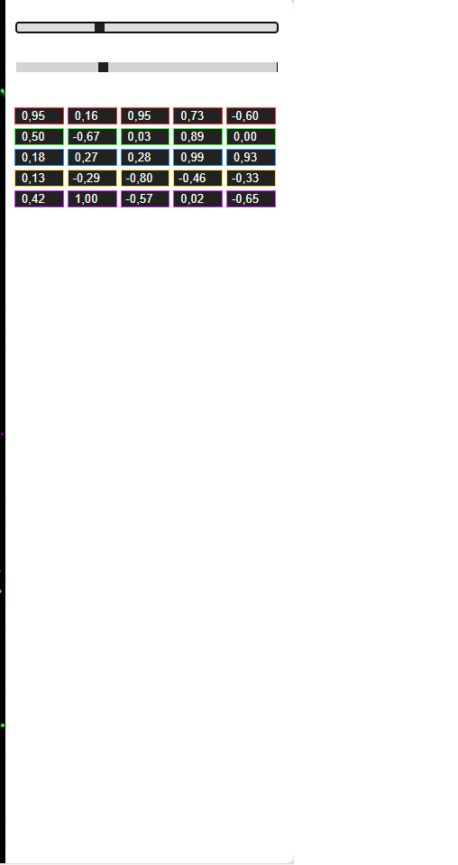
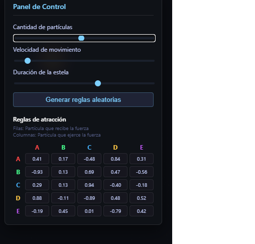
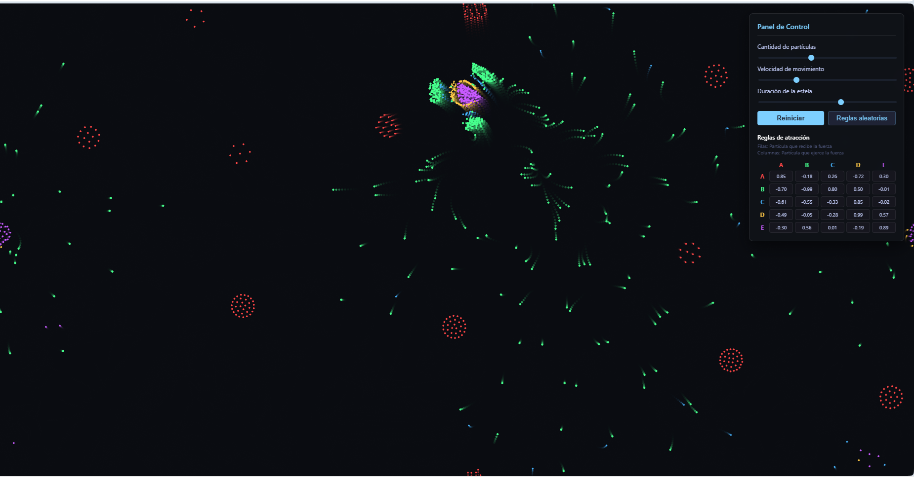
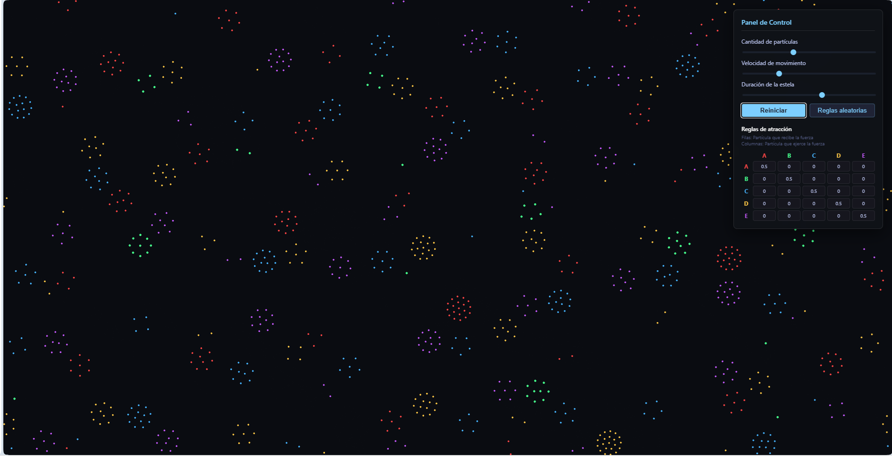
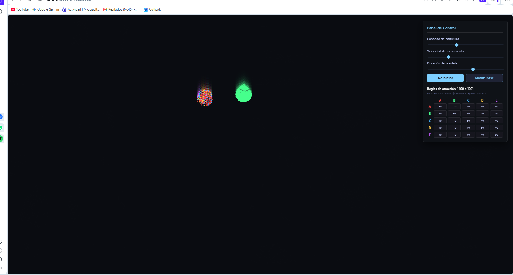
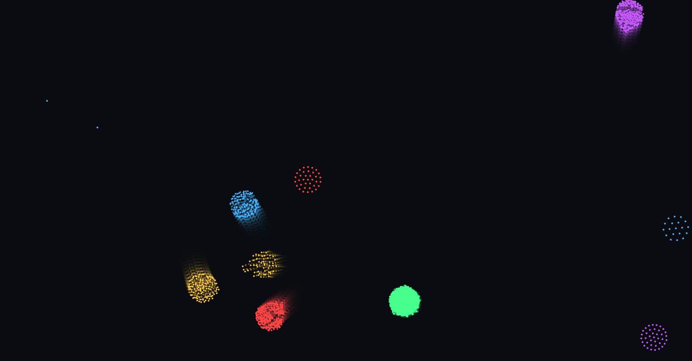

# Simulacion-2026

Bitácora Unidad 1

## Actividad 1

Vi los videos propuestos en la unidad como referentes, y me sirvieron para entender hasta donde puede llegar el arte generativo, me sirvió   como inspiración.

## Actividad 2

Analizamos el ejemplo del random walk, lo pude ejecutar y verlo funcionando en línea y local.

## Actividad 3

Analizamos las distribuciónes de probabilidad, vimos el ejemplo de una distribución gaussiana.

Una distribución uniforme de la aleatorieidad implica que haya la misma probabilidad de obtener cualquiera de las posibles opciones, mientras que una distribución no uniforme favorece ciertos resultados por lo que al final obtendrías una línea con huecos o difuminada en alguna dirección.

## Actividad 4

Distribución normal.

me ayudé de la Ia para generar el código pero desarrollé la idea, quería representarlo como un anillo rgb alrededor donde se haga click con el mouse

## Actividad 5

Para aplicar la distribución levy flight decidí utilizar el walker, y obtuve este resultado creando un metodo levy, que luego utilicé en el cálculo del step para agregar una probabilidad de tener un paso mucho mas largo que el anterior, no esperaba que los conectara una linea, pero de resto funciono como se esperaba.

## Actividad 6

decidí representar el ruido perlin con un triangulo rotativo, viendo el ejemplo de la documentación con el círculo, me dio curiosidad como se vería con un triangulo que rota generando la sensación de un espiral, el resultado fue el esperado, pero se vería mejor con más duración del rastro y un movimiento más lento.

## Reto de diseño

Para el reto de diseño, decidí que la temática para desarrollar estas ideas de la aleatorieidad iba a ser, el jardín de senderos que se bifurcan, cuento de Jorge Luis Borges, desafortunadamente, no tomé pruebas visuales del desarrollo, pero si anoté el proceso y cambios en la idea principal, en un inicio decidí generar 4 puntos moviendose desde el centro de la pantalla hacia los bordes de esta manera

inicialmente no había caminos siendo recorridos, pero al dividir la pantalla en 4 me surgió la idea, y si el usuario puede añadir caminos, y allí podemos encontrar la aleatorieidad y las posibilidades?

entonces decidí hacerlo de esta manera, al principío las líneas generadas no creaban un patrón visualmente atractivo o muy diciente, y las bolas rebotaban mucho, entonces hubo que añadir orden a lo aleatorio, enderezando el ángulo, cambiando el tamaño de las líneas, aplicando levy flight para los caminos especiales, un walker con probabilidades uniformes y distribución normal con la longitud de las líneas, en térmminos de conceptualización lo hice todo el proceso de manera autónoma, y utilicé la IA para añadir cosas paso por paso en base a mis necesidades, y corregí acordemente en base a mis necesidades en cuanto a velocidades, tamaños y ángulos.

http://127.0.0.1:5500/sim2026-20-Test%20Miguel%20Escobar/

Encargo Completo: 5

Simulación con intención: 5

siento que me enfoque en el aspecto de diseño más que en la ejecución, logrando utilizar conceptos como distribución normal, y levy flight, y dando sentido a la aleatorieidad.

Interacción signigicativa: 5 

Prototipo funcional: 5

Proceso documentado: 5

# Unidad 2

En esta unidad, tras haber estudiado los referentes de arte generativo y particle life, tengo un mejor entendimiento de lo que pasa detrás de las obras de arte que hemos analizado, y sirvió como inspiración, no de un fin específico, sino de la experimentación con las fuerzas y vectores para llegar a cosas nuevas.

En un inicio le pedí ayuda a la IA para la generación del sistema y la interfaz de usuario con el siguiente prompt:

" hola, estoy trabajando en arte generativo con jsp5, estoy trabajando puntualmente particle live, basándome principalmente en el trabajo de Max Cooper y Tom Mhor, necesito que me generes el código necesario para un sistema de particulas de diferentes colores, sus interacciones en la matriz son determinadas por su cercanía y las reglas que condicione yo en el sistema.

osea, algo como lo de la imagen, pero que la interfaz solo conserve sliders para el número de particulas y el trail, y en vez de las otras cosas tenga la matriz de 5*5 con casillas interactuables por el usuario "

Esto con un screenshot de la pagina clusters.  

Ya con el sistema en mano me puse manos a la obra para mejorarlo, lo primero que hice fue arreglar la interfaz, ya que inicialmente lucía así.

Decidí hacerla más atractiva y añadir un slider para la velocidad

A continuación viene lo complejo, decidí que para la actividad, quería explorar la tensión entre la enfermedad y la cercanía, por lo que decidí ajustar el sistema de la siguiente manera:

5 especies de partículas, 1, la verde siendo foco de infección, además introduje la regla de que si alguna particula pasa 5 segundos cerca de una partícula verde se convertirá en verde.

La cantidad de particulas es graduable, pero se configuró para que las verdes representen un 2% del total de partículas.

Estamos trabajando con una matriz mixta, con valores entre -1 y 1, los negativos siendo la repulsión y los positivos la atraccción, pues las 2 cosas deben ser posibles para ejecutar mi idea, los enfermos buscan ayuda en las poblaciones y las poblaciones tratan de eludirlos.

La velocidad máxima está parametrizada de manera variable, pero la fricción base es de 0.82.

La generación inicial es aleatoria excepto con la cantidad de partículas verdes, que representa un 2% como uno o dos pacientes de un virus

En cuanto a las constantes tenemos 5 como numero de especies, tenemos el radio maximo de interaccion 110, un area de contagio de 35, los 5 segundos requeridos para la infección y un límite de fuerza máximo aplicable por fotograma.

Los parametros variables son los sliders de la interfaz y los cuadros de la matriz.

Inicialmente el programa se veía como el de cluster, pues le pedí a la IA que me ayudara a generar algo similar, sin embargo rapidamente aplique los cambios empecé a obtener comportamientos distintos, con las reglas anteriormente mencionadas obtuve algo así.

con los grupos de partículas eventualmente volviéndose verdes, sin embargo no es lo que quería, todavía deseo hacer un diseño más orgánico, entonces lo que nos restaba era jugar con las fuerzas de interacción, lo que quice definir en un principio es, las poblaciones no se atraen entre ellas, exceptuando las verdes, que se ven atraidas a cualquier población.

con esto me acerqué a lo que quería, y obtuve un comportamiento interesante, más cercano a la manera en que se esparce una idea, a la que se esparce un virus, por la naturaleza estática de las partículas. se hacen cumulos y los cumulos cerca de los verdes, lentamente empiezan a ser absorviddos por los cumulos verdes, hasta que no hay ninguna partícula lo suficientemente cerca.

Luego de jugar un poco con las fuerzas, cambiando fundamentalmente laas relacionadas con las verdes obtuve lo que quería.

sin embargo no me parecía lo suficientemente interesante o representativo de la idea, por lo que decidí añadir otra regla, despues de que se supera una cantidad de partículas verdes en el sistema, las restantes empiezan a experimentar atracción 
entre ellas.

y finalmente obtuve lo que buscaba, al final imita el comportamiento de poblaciones con un virus por ejemplo, al final quedan todos los casos aislados, la comunidad restante alejandose de ellos constantemente.

# Unidad 3#

